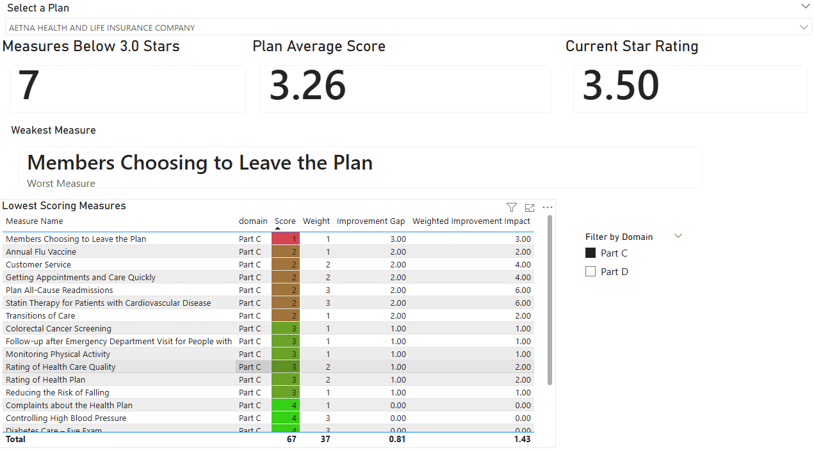

# Medicare Advantage Star Ratings Impact Analysis

*Identifying high-impact quality measures to help Medicare Advantage plans unlock $100M+ in annual bonus payments*

---

## Project Overview

**Business Problem:** 141 Medicare Advantage health plans are rated at 3.5 stars—just 0.5 stars away from eligibility for Quality Bonus Payments worth hundreds of millions of dollars annually. This project analyzes CMS Star Ratings data to identify which specific quality measures these plans should prioritize to maximize their rating improvement.

**Key Question:** *With limited resources, which measures offer the highest ROI for improving overall star ratings?*

**Impact:** CMS distributes ~$11 billion annually in bonus payments to 4+ star plans. Strategic focus on 2-3 high-weight measures could move plans from 3.5 to 4.0 stars within 12-18 months.

---

## Business Context

### The Medicare Advantage Star Ratings System

Medicare Advantage plans are rated 1-5 stars based on ~42 quality measures across:
- **Clinical Outcomes** (e.g., hospital readmissions, diabetes control) - *Weight: 3x*
- **Patient Experience** (CAHPS surveys) - *Weight: 1.5-4x*
- **Access & Service** (call centers, appeals) - *Weight: 1x*
- **Medication Adherence** (Part D measures) - *Weight: 3x*

### Why Star Ratings Matter

| Star Rating | Bonus Payment | Member Impact |
|-------------|--------------|---------------|
| **5.0 stars** | 5% bonus | "High performing" icon on Medicare.gov |
| **4.0-4.5 stars** | 5% bonus | Eligible for rebates & benefits |
| **3.5 stars** | No bonus | Just below threshold |
| **≤ 3.0 stars** | No bonus | "Low performing" if consistent |

**The Opportunity:** 141 plans at 3.5 stars represent $billions in unrealized bonus payments.

---

## Key Findings

### 1. The Near-Bonus Opportunity is Massive
- **141 plans (26%)** are stuck at 3.5 stars
- Collectively serve millions of Medicare beneficiaries
- Missing out on hundreds of millions in bonus payments
- Most are just **2-3 measure improvements** away from 4.0 stars

### 2. High-Impact Measures Drive Disproportionate Value

**Top 3 Improvement Opportunities:**

| Measure ID | Measure Name | Avg Score | Weight | Improvement Potential |
|-----------|--------------|-----------|--------|---------------------|
| **C15** | All-Cause Readmissions | 2.04 | 3x | **5.89** |
| **C16** | Statin Therapy (CVD) | 2.25 | 3x | **5.25** |
| **D10** | Cholesterol Medication Adherence | 2.32 | 3x | **5.03** |

**Insight:** These triple-weighted measures offer **3x more impact** per point improvement than standard measures.

### 3. Clinical Outcomes vs. Operational Excellence

**Where plans excel:**
- Call center accessibility (4.48 avg)
- Customer service (4.43 avg)
- Administrative processes (4.30+ avg)

**Where plans struggle:**
- Hospital readmissions (2.04 avg)
- Medication adherence (2.32-2.66 avg)
- Care transitions (2.17 avg)

**Strategic Insight:** The path to 4 stars runs through clinical effectiveness, not operational efficiency.

### 4. Improvement is Achievable

High variance in measure scores proves excellence is possible:
- Readmissions: Some 3.5-star plans score 4.0+
- Medication adherence: Ranges from 2.0 to 4.0 stars among similar plans
- **Takeaway:** This is about adopting best practices, not doing the impossible

---

## Business Recommendations

### For 3.5-Star Plans: Fast Track to 4 Stars

**Phase 1: Attack Triple-Weighted Measures (Months 1-6)**

Focus on **3 high-ROI measures:**

1. **Reduce Readmissions (C15)** → Target: 2.0 → 3.5 stars
   - Implement 72-hour post-discharge calls
   - Medication reconciliation programs
   - Care transition teams

2. **Improve Cholesterol Medication Adherence (D10)** → Target: 2.3 → 3.5 stars
   - Automated refill reminders
   - 90-day prescriptions
   - Pharmacist outreach programs

3. **Boost Statin Therapy (C16)** → Target: 2.25 → 3.5 stars
   - Provider clinical decision support
   - Patient education materials
   - Standing orders protocols

**Expected Impact:** Moving these 3 measures could increase overall rating by 0.4-0.6 stars

**Phase 2: Quick Wins on Patient Experience (Months 3-9)**
- Reduce call wait times (C21)
- Improve appointment access (C20)
- Enhance member communications (C23)

### ROI Analysis

**Investment:** $5-15M (care coordination, technology, training)  
**Return:** $100-300M annual bonus payments  
**ROI:** **10-60x in year 1**, continuing indefinitely

---

## Technical Implementation

### Tech Stack

| Component | Technology |
|-----------|-----------|
| **Data Exploration** | Python, Jupyter Notebook, pandas, matplotlib, seaborn |
| **Database** | PostgreSQL, Docker |
| **ETL Pipeline** | Python (SQLAlchemy, pandas) |
| **Analysis** | SQL (CTEs, window functions, complex joins) |
| **Visualization** | Power BI Desktop |

### Project Architecture
```
┌─────────────────┐
│  CMS Raw Data   │  (CSV files - 857 contracts, 42 measures)
│   (Public API)  │
└────────┬────────┘
         │
         ▼
┌─────────────────┐
│ ETL Pipeline    │  (Python + PostgreSQL)
│ • Load to       │
│   Staging       │
│ • Transform     │
│ • Normalize     │
└────────┬────────┘
         │
         ▼
┌─────────────────┐
│  PostgreSQL DB  │  (Normalized schema - 4 production tables)
│ • contracts     │
│ • measures      │
│ • scores        │
│ • metadata      │
└────────┬────────┘
         │
         ▼
┌─────────────────┐
│  SQL Analysis   │  (Complex queries - prioritization logic)
└────────┬────────┘
         │
         ▼
┌─────────────────┐
│  Power BI       │  (Executive dashboard - 2 pages)
│  Dashboard      │
└─────────────────┘
```

### Database Schema

**Normalized Design (3NF):**
```sql
-- Core production tables
contracts (
    contract_id PRIMARY KEY,
    contract_name,
    organization_type,
    overall_star_rating,
    year
)

measure_metadata (
    measure_id PRIMARY KEY,
    measure_name,
    domain,
    weight  -- 1.0, 1.5, 3.0, or 4.0
)

measure_scores (
    contract_id REFERENCES contracts,
    measure_id REFERENCES measure_metadata,
    score,
    year,
    PRIMARY KEY (contract_id, measure_id, year)
)
```

**Key Design Decisions:**
- Staging tables for raw data landing (idempotent ETL)
- Normalized star → long format (35,994 measure scores)
- Indexed foreign keys for query performance
- Data quality checks built into pipeline

---

## Key SQL Queries

### Query 1: Identify Near-Bonus Plans
```sql
SELECT contract_id, contract_name, overall_star_rating
FROM contracts
WHERE overall_star_rating = 3.5
ORDER BY contract_name;
```
**Result:** 141 plans identified

### Query 2: Calculate Improvement Potential (Complex Analysis)
```sql
WITH plan_opportunities AS (
    SELECT 
        ms.measure_id,
        mm.measure_name,
        mm.weight,
        AVG(ms.score) as avg_score,
        COUNT(*) as num_plans_struggling
    FROM measure_scores ms
    JOIN measure_metadata mm ON ms.measure_id = mm.measure_id
    JOIN contracts c ON TRIM(ms.contract_id) = TRIM(c.contract_id)
    WHERE c.overall_star_rating = 3.5
      AND ms.score IS NOT NULL
      AND ms.score < 4.0
    GROUP BY ms.measure_id, mm.measure_name, mm.weight
)
SELECT 
    measure_id,
    measure_name,
    weight,
    ROUND(avg_score, 2) as avg_score,
    num_plans_struggling,
    ROUND(weight * (4.0 - avg_score), 2) as improvement_potential
FROM plan_opportunities
ORDER BY improvement_potential DESC;
```
**Result:** Ranked 42 measures by ROI

### Query 3: Plan-Specific Recommendations
```sql
SELECT 
    c.contract_name,
    ms.measure_id,
    mm.measure_name,
    ms.score as current_score,
    mm.weight,
    ROUND(mm.weight * (4.0 - ms.score), 2) as impact_if_improved_to_4,
    CASE 
        WHEN ms.score <= 2.0 THEN 'CRITICAL'
        WHEN ms.score < 4.0 THEN 'HIGH'
        ELSE 'MEDIUM'
    END as priority
FROM contracts c
JOIN measure_scores ms ON TRIM(c.contract_id) = TRIM(ms.contract_id)
JOIN measure_metadata mm ON ms.measure_id = mm.measure_id
WHERE c.contract_id = 'H0907'  -- Specific plan
  AND ms.score IS NOT NULL
  AND ms.score < 4.0
ORDER BY impact_if_improved_to_4 DESC;
```
**Result:** Top 10 priorities for individual plans

---

## Dashboard & Visualizations

### Page 1: Industry Overview


**KPIs:**
- 141 plans near bonus threshold
- 3.42 average measure score
- 91.31 total improvement potential

### Page 2: Plan-Specific Deep Dive


**Interactive Features:**
- Dropdown slicer to select any 3.5-star plan
- KPIs: Plan's average score, number of low measures
- Table: Weakest measures with prioritized recommendations
- Comparison to industry benchmarks

---

## Project Structure
```
medicare_star_ratings/
├── data/
│   └── raw/                          # CMS CSV files (not in repo)
├── sql/
│   ├── 01_schema.sql                 # Database schema
│   ├── 02_load_data.py               # ETL - Extract & Load
│   ├── 03_transform.py               # ETL - Transform
│   ├── 04_data_quality.py            # Validation checks
│   ├── 05_update_weights.sql         # Business logic
│   ├── 06_analysis_queries.sql       # Core SQL analysis
│   └── 07_export_for_powerbi.py      # Data export
├── powerbi_data/                     # Exported CSVs for Power BI
├── images/                           # Dashboard screenshots
├── Phase1_Data_Exploration.ipynb     # Jupyter notebook
├── Medicare_Star_Ratings.pbix        # Power BI file
└── README.md
```

---


